# Arizona & California Weather Analysis

## Introduction

This report mainly analysis the historical weather patterns in an area that approximately overlaps the state of **Arizona** and **California**.

### Data

The dataset this report uses has index '**SSSSSSBB**'. It totally contains **47** weather stations scattered in the state of Arizona and California.

The following chart shows some stations in the dataset and their corresponding city name:

|   station   | latitude | longitude |          city           |
| :---------: | :------: | :-------: | :---------------------: |
| USC00021282 | 33.8161  | -111.9019 |    Carefree, AZ, USA    |
| USC00027460 | 33.7333  | -113.5333 |     Salome, AZ, USA     |
| USC00021361 | 33.8333  |  -111.95  |   Cave Creek, AZ, USA   |
| USC00040924 | 33.6131  | -114.5972 |     Blythe, CA, USA     |
| USC00042598 | 33.8089  | -115.4508 | Desert Center, CA, USA  |
| USC00027462 | 33.6833  | -113.4833 |     Salome, AZ, USA     |
| USC00024829 | 33.3369  | -112.1472 |    Phoenix, AZ, USA     |
| USC00045860 | 34.0864  | -116.5622 | Morongo Valley, CA, USA |

<br>

I use sql query to find some cities located in the boundary of the area, and draw the approximated area in the following picture:

<p>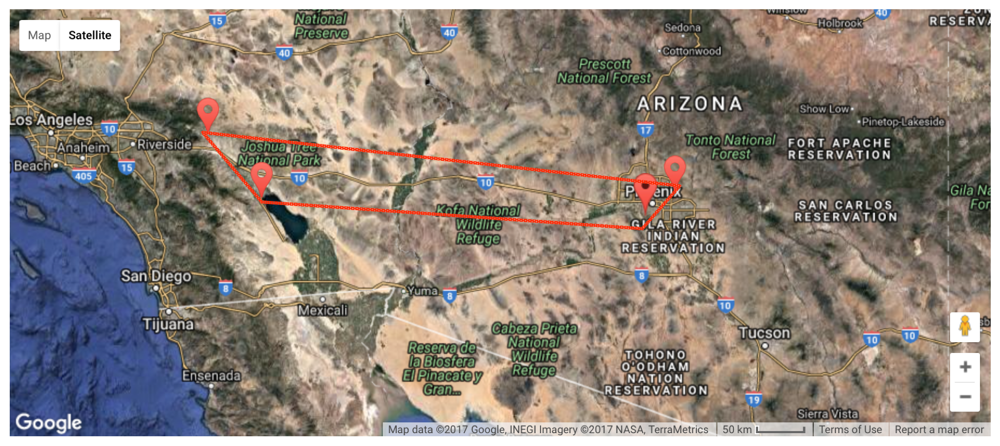</p>

<br>

There are six measurements in the dataset:

- **TMIN, TMAX:** the daily minimum and maximum temperature.
- **TOBS:** The average temperature for each day.
- **PRCP:** Daily Percipitation (in mm)
- **SNOW:** Daily snowfall (in mm)
- **SNWD:** The depth of accumulated snow.

This report will mainly focus on **TOBS**.


### Data Check

It's important to check whether the dataset has reasonable data. Since the area is in the south-west of USA, which means the **temperature** should be relatively high, **precipitation** should be relatively low, and the **snow** should be nearly impossible in this area.


In order to check the data, we use a site called <a href="http://www.usclimatedata.com/climate/blythe/california/united-states/usca0110">US Climate Data</a>  to find the climate graph of one city in the area —— Blythe, CA.

<p>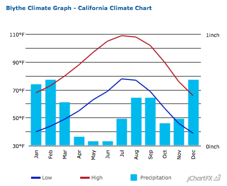</p>

I also use <a href="https://en.wikipedia.org/wiki/Tonopah,_Arizona">wiki</a> to find the climate data for another city in the area —— Tonopah, Arizona.

<p>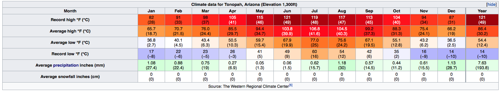</p>

According to the data of two cities in the area online, we could easy find that:

- **TMAX** ranges from 70 °F to 110 °F (21 °C to 43 °C) around a year.
- **TMIN** ranges from 40 °F to 80 °F (4 °C to 26 °C) around a year.
- **PRCP** is large during Dec. to Mar., is very small during Apr. to Jun.. The amount is not to large, range from 1mm to 30 mm per month. However, the amount is relative small compared to other areas. 
- **SNOW** is zero around a year.

Although two cities differ slightly in some aspects, the data generally agrees with my anticipation.

<br>

Now, let's have a look at the pattern in the dataset. The following graphs shows the mean and standard deviation of each of six measurements of all the stations. 

<p></p>
<p>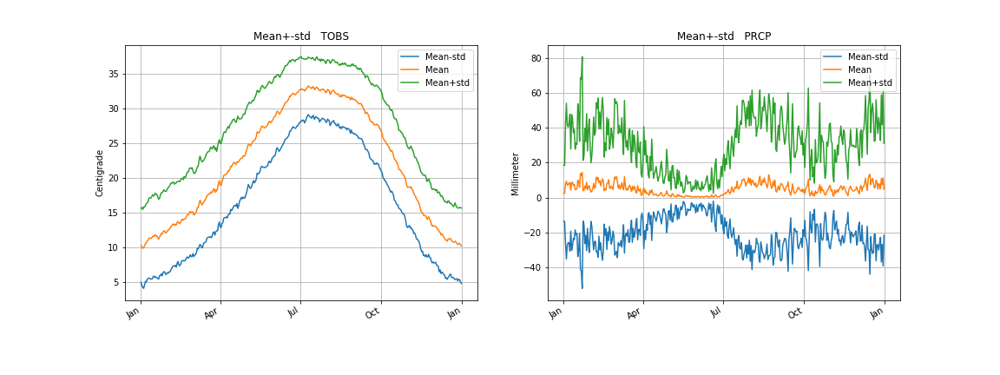</p>
<p>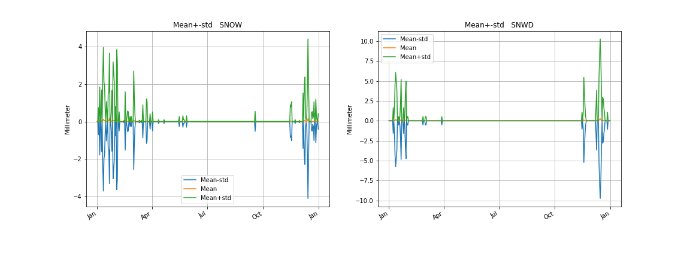</p>

From the above graphs, it is clear that the data agrees with the online resources and expectations:

- **TMAX** has mean in range of 18 °C to 40 °C around a year. It has peak in July.
- **TMIN** has mean in range of 3 °C to 24 °C around a year. It has peak in July.
- **TOBS** has mean in range of 10 °C to 33 °C around a year. It has peak in July.
- **RPCP** has mean oscillated between 0 mm and 10 mm per day. The curve has two lower troughs from Apr. to Jul. and from Oct. to Nov., which has the same trend as the online data.
- **SNOW** has mean close to constant zero, only grows slightly in winter.
- **SNWD** is similar to SNOW.


## PCA Analysis

Since we want to use less eigenvectors to explain variance as much as we can, I plot the percentage of variance explained vs number of eigenvector for each of six measurements. Here I only show the first ten eigenvectors:

<p>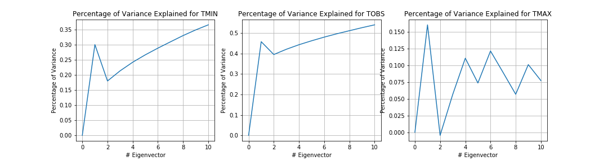</p>

<p></p>


There is a problem that is when the number of eigenvector increase, the percentage of variance even decreased for the first three measurements. It is because there are some eigenvalues that are negative. 


Since the eigen decomposition is not as precise as expected, I sort the eigenvalues in decreasing order with their corresponding eigenvectors, then the top eigenvectors have the largest ability to explain the variance. The results after sorting is as following : 

<p>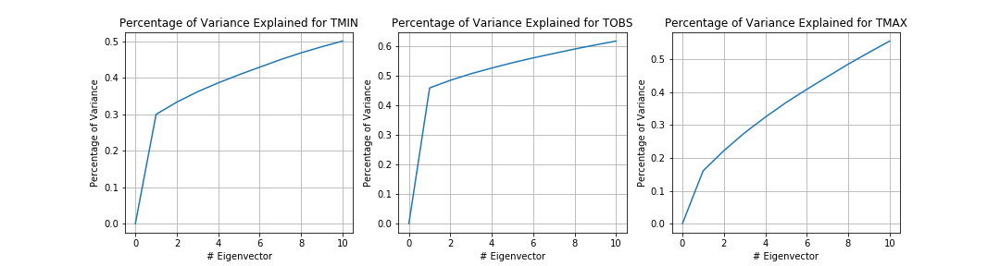</p>


We totally have 365 eigenvectors, what will happen if we use all of the eigenvectors? The percentage of variance explained should be very close to 1. The following graph show the results:

<p>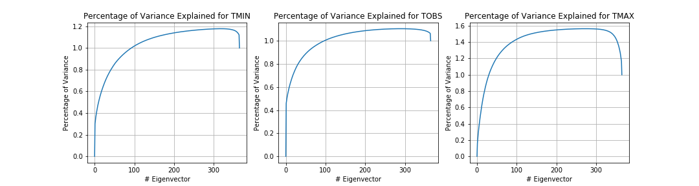</p>

Now, you may find something wrong. That is the percentage even exceed 100% and then falls back to 100%. It is also owing to the unexpected negative eigenvalues. So I set all the negative eigenvalues to zero, and the problem is solved. Then I plot it again using only the first 10 eigenvectors:

 <p>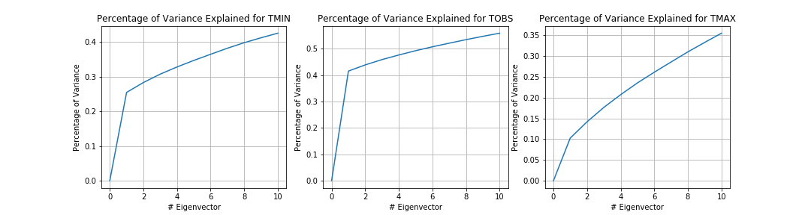</p>

<p>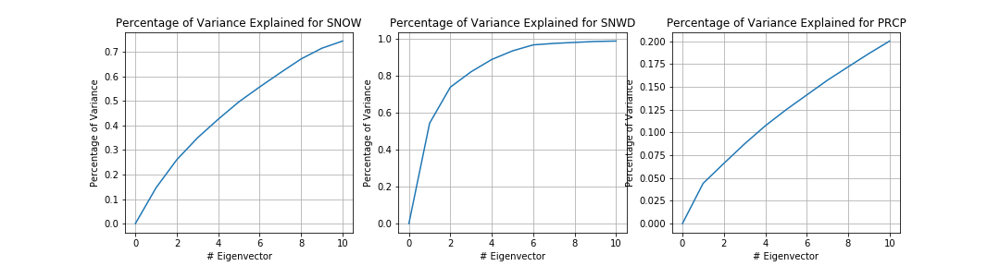</p>


From the above graph, we see that top 5 eigenvectors explain **35%**, **50%**, **23%**, **12.5%** of **TMIN**, **TOBS**, **TMAX** and **PRCP**, respectively. However, top 5 eigenvectors explain **90%** and **50%** of **SNWD** and **SNOW**, respectively.

It seems that it is perfect that only a few number of eigenvectors can explain nearly all the variance of **SNWD**. However, I think it is less meaningful, because actually the mean of SNWD is close to zero, even in winter.


So I will mainly focus on **TOBS**. 

The graph shows that only one eigenvector will explain 40% of variance, which is relative high. With the increasement of eigenvector numbers, the percentage of variance explained increases slowly. So I will only use the top 4 eigenvectors. The following graphs show the mean of TOBS and the top 4 eigenvectors:

 <p>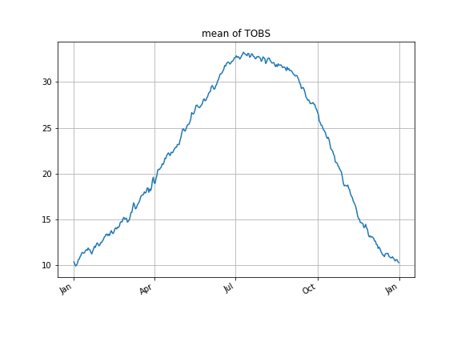</p>

<p>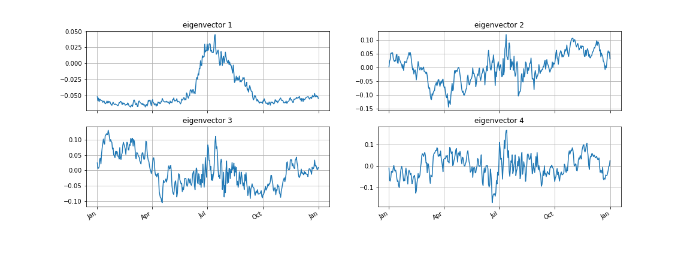</p>

We know that the first eigenvector explain 40% of variance. According to the graph of eigenvector 1, this curve has the same trend with that of the mean of TOBS, which also explains why the first eigenvector explain variance so much. However, eigenvector 1 has flat values during Jan. to May. and Oct. to Jan..


Eigenvector 2, 3 and 4 don't have clear patterns, however, we could find that eigenvector 2 has large positive values during Oct. to Jan., and eigenvector 3 has large positive values during Jan. to Apr, and eigenvector 4 has large positive values during Mar. to May.


In other words,

- eig1 : Higher temperature in Jul.. Lower temperature otherwise.
- eig2 : Higher temperature from Oct. to Feb., and much higher in a small period in Jul..
- eig3 : Higher temperature from Jun. to Apr., and in a small period in Jul.. 
- eig4 : Higher temperature from Mar. to Jun., from Jul. to Sep. and from Nov. to Jan.

These four eigenvectors have high temperature that cover different period of the whole year, which also means that the combination of them have the potential to explain the variance.


## Reconstructions

In this part, I will do experiments about PCA reconstructions for TOBS measurement.

I want to find out how well the PCA could reconstruct a specific year's TOBS data. 

First, let's have a look at the TOBS mean and TOBS in 1910.

 <p>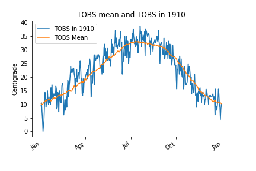</p>

From the above comparison, it's clearly that TOBS mean and TOBS in 1910 have the same trend. However, TOBS in 1910 has large difference between days. Say in summer, oneday it was sunny and hot in daytime, then the average temperature in that day may be around 35 °C. However, the next day it suddenly rained. The TMAX in that day was very slow, which made the average temperature under 30 °C. In this case, the data may show a rush drop in very close days. 

The unstable of specific day, or say the unpredictable of suddenly change of weather will make it harder to predict the accruate temperature. 

But, how do we know this is not a actually pattern?

Let's look at the following figure:

 <p></p>

Now we have the detailed data of two contiguous years. In the red rectangle, two years shows very large difference, even reversed. That shows the suddenly weather change between contiguous days is not a pattern between years.

<br>

In order to reconstruct the data of a particular year, let's firstly have a look at the mean and top 4 eigenvectors of a time series.

<p>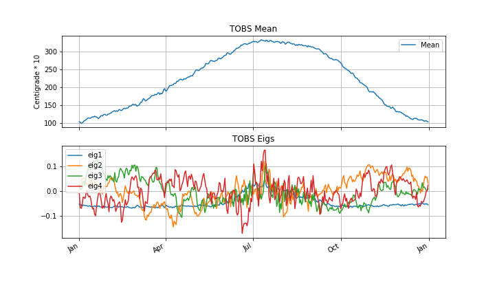</p>

Now, let's use these four eigenvectors to reconstruct a randomly selected year data:

<p>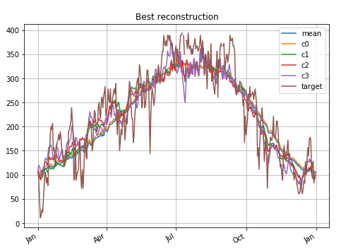</p>

The figure contains five lines:

- **mean** : the TOBS mean of all the data
- **c0** : the approximated data using only top 1 eigenvector.
- **c1** : the approximated data using only top 2 eigenvectors.
- **c2** : the approximated data using only top 3 eigenvectors.
- **c3** : the approximated data using only top 4 eigenvectors.
- **target** : the data we want to approximate.

I find that although the target has the same trend with mean, target has very large difference between close days. 

Now let's have a close look at the results for the four cases:

<p>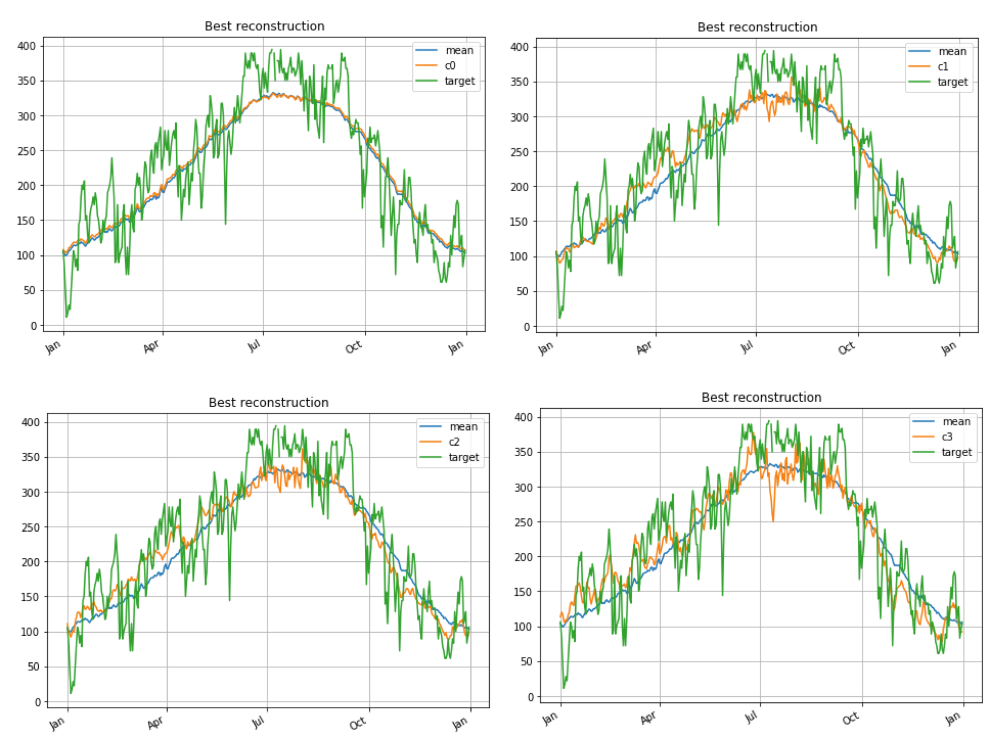</p>

When we only use the first eigenvector, the result line is very close to the mean. Previously, I have shown that eig1 is very similar to the trend of the TOBS mean, and only itself could explain nearly 50% variance. So it means that eig1 is contribute most to the trend of approximation. It makes the approximation make sense —— low temperature in winter, high temperature in summer. 

When we add eig2, eig3, and eig4, the result curve becomes less and less smooth. And the difference between days becomes larger and larger.

Above all, using more eigenvectors will make the approximation more accurate. 


### Best and Worst

Now, we focus on the whole data, and we want to know how well the PAC performs on the whole data.

Here I use residual variance as the standard to judge performance:

- **res_mean** : the residual variance using mean as the approximation.
- **res1** : the residual variance after adding eig1.
- **res2** : the residual variance after adding eig2.
- **res3** : the residual variance after adding eig3.
- **res4** : the residual variance after adding eig4.

According to the computiation method of the above values, I know that ```res1``` to ```res4``` are residuals reduction percentage compared to res_mean. So if ```res1``` to ```res4``` are less than 1, then adding eigenvector helps reduce the residual. Otherwise, it even increase the residual than just using mean.

#### Best

Here are the top 12 best reconstruction results:

<p>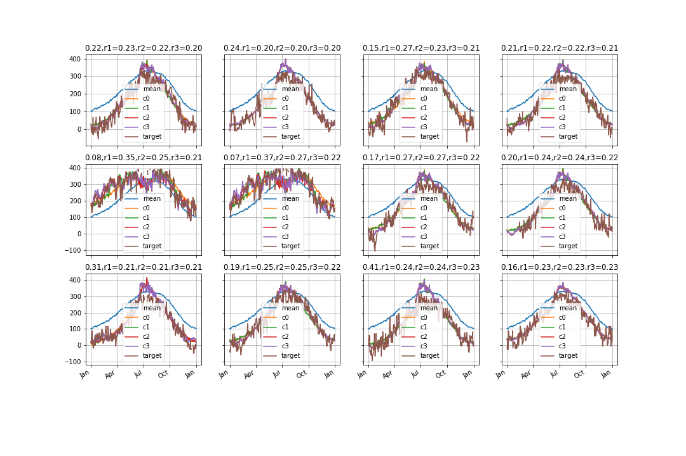</p>

<p>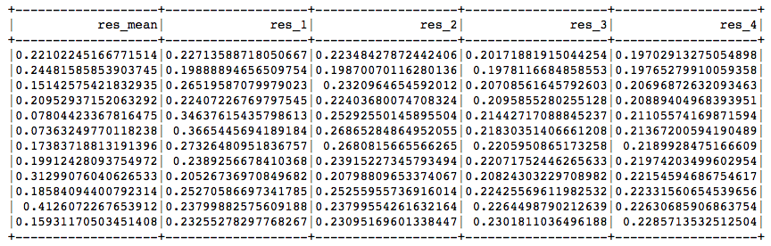</p>

From the above figure, I find that some best cases are those cities that have TOBS that is generally lower than the mean of total TOBS. That shows the power of PCA.

Then focus on the residual, all of the ```res1``` to ```res4``` are less than 1 and are very small, which means adding eigenvectors on the mean greatly reduce the residuals. Also, ```res_i``` decrease when ```i``` increase, which means more eigenvectors reduce residuals more.

#### Worst

Then let's look at the top 12 worst reconstruction results:

 <p>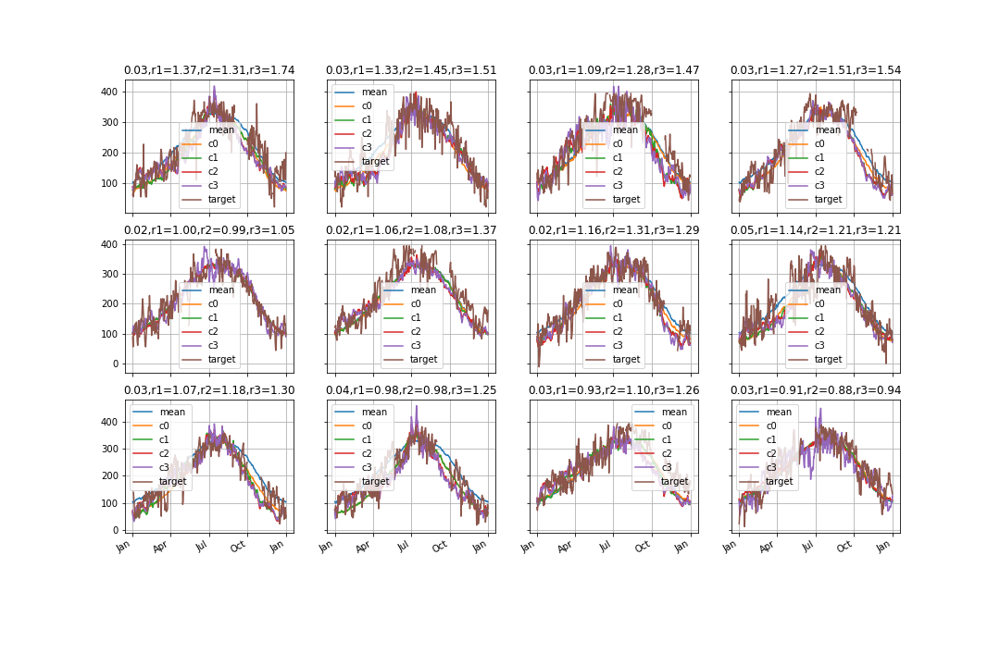</p>

<p>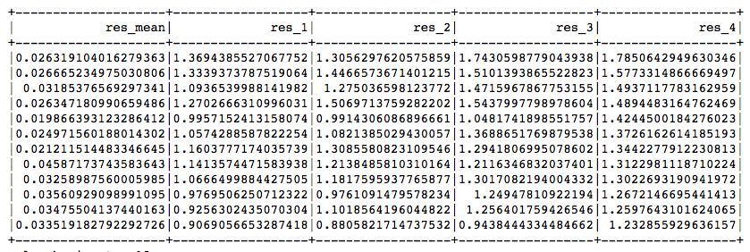</p>

In the worst case, I find nearly all these cities have TOBS similar to mean. It can also be shown by ```res_mean```. Compare ```res_mean``` with best case and worst case, I find best case most have values around 0.2, while worst case most have values around 0.02. It means : 

- **in worst case, only use mean could describe the real data very well, adding more eigenvectors helps little or even make approximation worse.** 
- **in best case, the real data have a large difference with TOBS mean, so using mean is very bad, and adding eigenvectors will help greatly.**

#### Total

Now let's have look at how well-explained are the eigenvectors in this collection.

<p>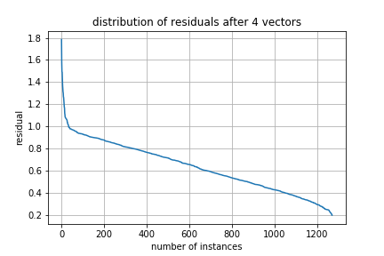</p>

The above figure shows that only very few instances (10 to 20 or so) have worse approximation when adding four eigenvectors than just using mean. And most of them will have better approximation after using more eigenvectors. 

So in general, we could have the conclusion that using eigenvectors with mean will help us make more accurate approximation. 

## Residual Analysis

### CDF of Daily Temperature

First, let's look at the CDF of daily temperature:

<p>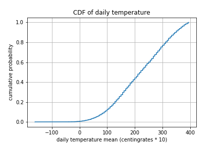</p>

According to this figure, we could conclude that:

- the probability for a day to have temperature mean in range of [30 °C ,40 °C] is around **20%**.
- the probability for a day to have temperature mean in range of [20 °C ,30 °C] is around **35%**.
- the probability for a day to have temperature mean in range of [10 °C ,20 °C] is around **30%**.
- the probability for a day to have temperature mean in range of [0 °C ,10 °C] is around **15%**.
- the probability for a day to have temperature mean in range of (-∞ °C ,0 °C] is around **0%**. 

The most interesting finding is should be the last conclusion. It can be shown in the figure because it has a very very long tail before 0  °C, and the average value of the tail is close to zero. If we calculate the integral of this area, which is actually the probability, then the integral should be very close to zero.

### Measuring Statistical Significance

In this part, I want to know the temperature relationship between two stations, such as if the weather is hot in one station, then how about another station?

I define hot when the temperature is larger than 35 °C. 

My hypothesis is as following : 

- **NULL Hypothesis** : the temperature patterns in two stations is **independent**.
- **Alternative Hypothesis** : the temperature patterns in two stations is **dependent**.

Before doing testing, let's just make a guess.

With the knowledge of previous work, it's easy to find out that the real temperature oscillated in a small range where the mean in the middle. And most of stations have the same trend of the increasement of temperature. So I believe the temperature in two stations is dependent, thus the NULL hypothesis should not be rejected.

After doing the test, we have the p-value equals 0.0119, which is less than 0.05. The p-value means the probability that we will see our data under the Null hypothesis. So the conclusion is that **we should reject the NULL hypothesis at 5% significance level.**

We can also convert p-value to the probability that two stations are hot at the same day. The result is 0.998. In other words, if a station is hot, there is a 98.8% probability that another station is hot, too.

#### Pair of Stations

Previously, I just pick two stations randomly. So it's unsafe to say that the previous conclusion always hold. 

Hence, I need to consider all of the pairs of stations, and do the same calculation between each pair of stations.

Now, let's look at the result:

<p>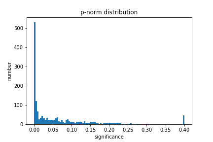</p>

In this figure, the significance is the p-value. If p-value is smaller, then the probability of seeing our data under Null hypothesis is smaller. So in this figure, most of the p-values are smaller than 0.05, which means in most cases, we will reject the Null hypothesis, or say the temperatures are not independent.

Let's show it in another way :

 <p>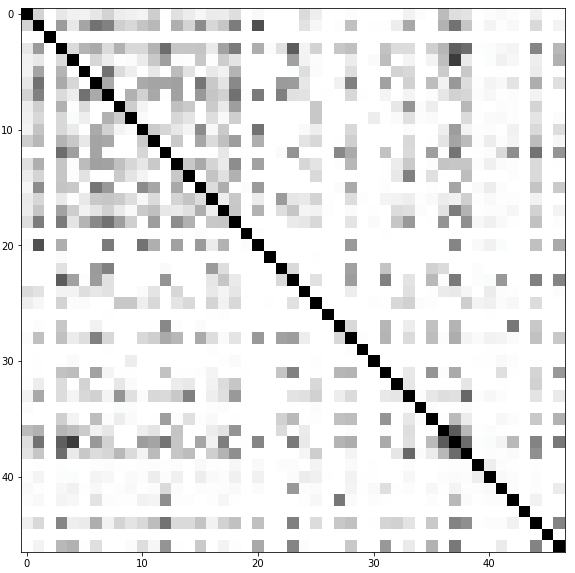</p>

Since there are totally 47 stations, so the above matrix is 47 * 47, where each cell representing the value of p-value. The whiter, the smaller p-value, the larger probability to reject Null hypothesis, and the larger probability to say that the temperatures in two stations are not independent.

Above all, we could get the conclusion that the temperatures of two different stations are **dependent**.

#### Correlation of Pairs of Stations

Now we have the p-value matrix, we want to know the correlation between different stations.

So we do PCA for the p-value matrix. The variance explained is shown as following : 

 <p>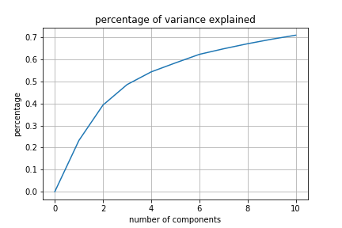</p>

Using four different orders, we have four different correlation matrixes : 

 <p>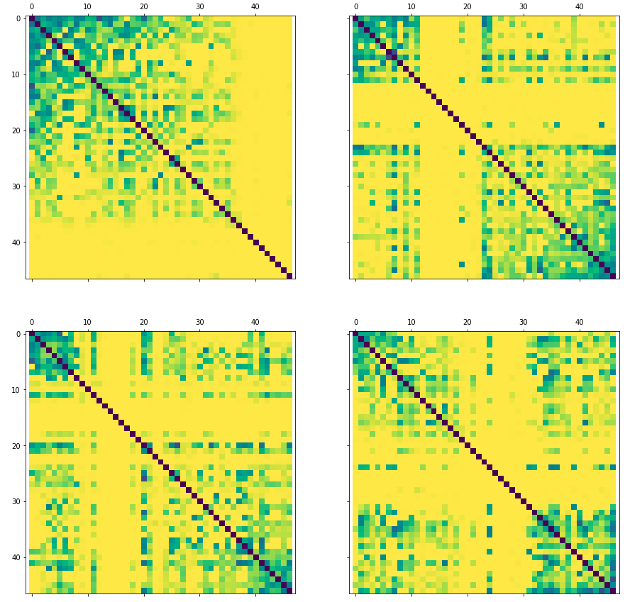</p>

No matter how we reorder the matrix, the group is evident, especially in the first matrix, where there is a large block on the top-left that are highly correlated. 

#### Effect of year vs Effect of Station

We want to know which one has larger influence on the TOBS, the year or the station. The effect is measured by the deduction of mean square root  of coefficients of the eigenvectors that are used to reconstruct real TOBS data. 

Here are the results  :

|               | total RMS | RMS removing mean-by-station | RMS removing mean-by-year |
| :-----------: | :-------: | :--------------------------: | :-----------------------: |
| coefficient 1 |  706.34   |            489.72            |          648.53           |
| coefficient 2 |  186.58   |            176.82            |          125.86           |
| coefficient 3 |  180.53   |            171.23            |          129.58           |
| coefficient 4 |  187.18   |            182.89            |          131.36           |

For coefficient 1, removing mean-by-station has larger effect, while for coefficient 2 to 4, removing mean-by-year has larger effect.

Just like the previous analysis, eigenvector 1 has the ability to make sure the trend of approximated data make sense, while others have the ability to change the detail of the approximated data. Removing mean-by-station causes the coefficient of eigenvector 1 drop largely, means that the in general, station difference cause the main difference of TOBS. It is reversed for the following three coefficient is exactly because they change the detail, and the detail varies for different years.

## Visualization on Map

In this part, I want to visualize the previous results.

First, let's have a look at the stations distribution in the area:

 <p>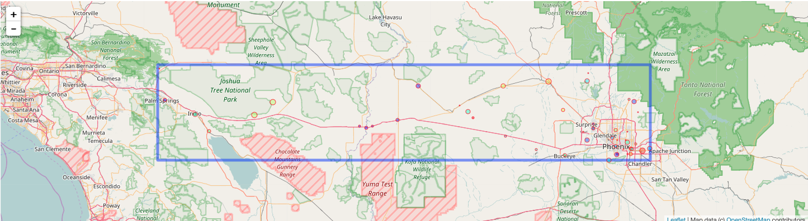</p>

<br>

Then let's visualize how coefficients of the four eigenvectors to reconstruct real data are changed when the elevation of stations changed:

 <p>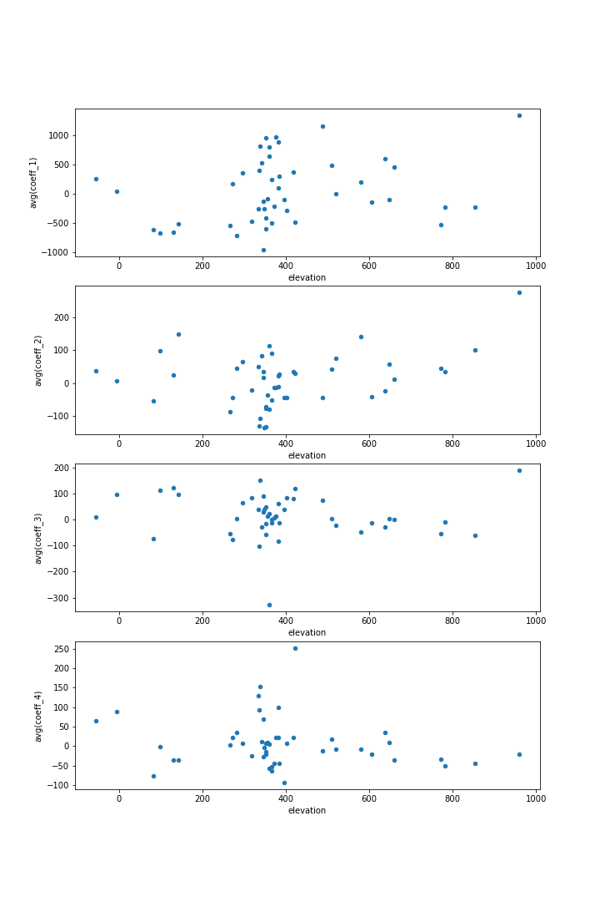</p>

The above figure shows how coefficient of eigenvector changes when the elevation of stations changed. However, from this figure, we cannot tell the pattern of it, because for a specific elevation, say 400, the distribution of coefficient are something like random. So the conclusion is that only elevation cannot influence TOBS too much.

<br>

Finally, let's have a look at the coefficients of the four eigenvectors to reconstruct p-value matrix.

 <p>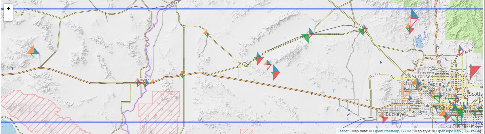</p>

where different colors means different coefficients:

- coefficient 1 : blue
- coefficient 2 : orange
- coefficient 3 : green
- coefficient 4 : red

From this figure, we could see that some stations shows a similarity of the triangulars, especially when they are close to each other:

 <p>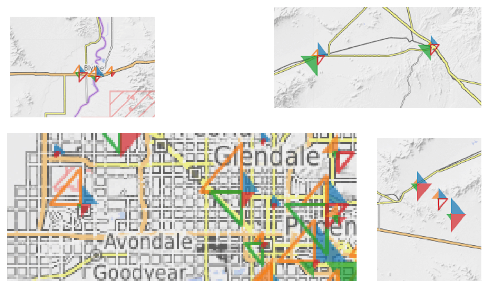</p>

This shows that close stations are more likely to be grouped together.


