# This is the report for hw5
In this report, we will analyze the weather data in United State.

# Massacusets Weather Analysis

This is a report on the historical analysis of weather patterns in an area that approximately overlaps the area of the state of Massachusets.

The data we will use here comes from [NOAA](https://www.ncdc.noaa.gov/). Specifically, it was downloaded from This [FTP site](ftp://ftp.ncdc.noaa.gov/pub/data/ghcn/daily/).

We focused on six measurements:
* **TMIN, TMAX:** the daily minimum and maximum temperature.
* **TOBS:** The average temperature for each day.
* **PRCP:** Daily Percipitation (in mm)
* **SNOW:** Daily snowfall (in mm)
* **SNWD:** The depth of accumulated snow.

## 4.4 Weather Analysis - Visualisation
In this part, we will focus on the station whose ID is USR0000CPNN.
There are 7 year-data collected by this station.

First, we will look at the average PRCP of each year in USC00043004 station.
We found the lowest PRCP in 2002 and the highest PRCP in 2001 and 2005, 2006, but the PRCP decreased in 2007.
<p>&nbsp;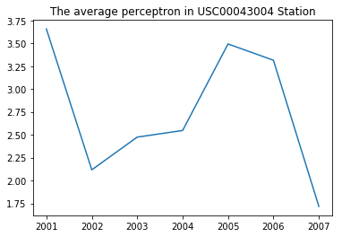</p>

Then, we will look at PRCP in the first two years in USC00043004 station.
<p>&nbsp;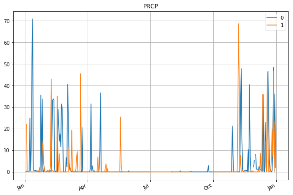</p>

However, it is hard to see the whole 7 years in one picutre.
As a result, we present it for the total PRCP in each month.
It is clear that PRCP is high in the wintern and spring in every year.
<p>&nbsp;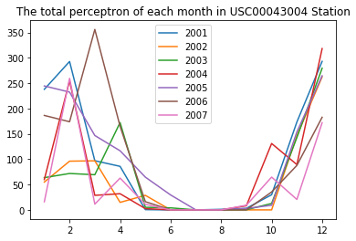</p>

We found the PRCP of each year concentrated on winter and not uniform.
Hence, we do **Chisquare-Test** to verify whether the PRCP of each month is the same.
From the following table, we safely conclude that **the PRCP of each month is siginificantly different for each year**.
<table>
  <thead>
    <tr>
      <th>Year</th>
      <th>Chisquare-Test-P_value</th>
    </tr>
  </thead>
  <tbody>
    <tr>
      <td>2001</td>
      <td>0.0</td>
    </tr>
    <tr>
      <td>2002</td>
      <td>4.62741329997e-258</td>
    </tr>
    <tr>
      <td>2003</td>
      <td>3.09997656337e-263</td>
    </tr>
    <tr>
      <td>2004</td>
      <td>0.0</td>
    </tr>
    <tr>
      <td>2005</td>
      <td>5.88093258247e-226</td>
    </tr>
    <tr>
      <td>2006</td>
      <td>1.00453501891e-294</td>
    </tr>
    <tr>
      <td>2007</td>
      <td>2.71318622523e-294</td>
    </tr>
  </tbody>
</table>

However, we found the PRCP of each year is similar.
Hence, we do **Correlation** to verify whether the PRCP of each year is the similar.
From the following table, we safely conclude that **we cannot reject the PRCP of each year siginificantly different**.
<table>
  <thead>
    <tr>
      <th>The</th>
      <th>correlation</th>
      <th>btween </th>
      <th>each</th>
      <th>year</th>
    </tr>
  </thead>
  <tbody>
    <tr>
      <td> The correlation</td>
      <td>2001</td>
      <td>2002</td>
      <td>2003</td>
      <td>2004</td>
      <td>2005</td>
      <td>2006</td>
      <td>2007</td>
    </tr>
    <tr>
      <td>2001</td>
      <td>1</td>
      <td>0.79</td>
      <td>0.71</td>
      <td>0.82</td>
      <td>0.96</td>
      <td>0.63</td>
      <td>0.74</td>
    </tr>
    <tr>
      <td>2002</td>
      <td>0.79</td>
      <td>1</td>
      <td>0.84</td>
      <td>0.78</td>
      <td>0.79</td>
      <td>0.54</td>
      <td>0.55</td>
    </tr>
    <tr>
      <td>2003</td>
      <td>0.71</td>
      <td>0.84</td>
      <td>1</td>
      <td>0.67</td>
      <td>0.73</td>
      <td>0.54</td>
      <td>0.51</td>
    </tr>
    <tr>
      <td>2004</td>
      <td>0.82</td>
      <td>0.78</td>
      <td>0.67</td>
      <td>1</td>
      <td>0.70</td>
      <td>0.37</td>
      <td>0.90</td>
    </tr>
    <tr>
      <td>2005</td>
      <td>0.96</td>
      <td>0.79</td>
      <td>0.73</td>
      <td>0.70</td>
      <td>1</td>
      <td>0.74</td>
      <td>0.62</td>
    </tr>
    <tr>
      <td>2006</td>
      <td>0.63</td>
      <td>0.54</td>
      <td>0.54</td>
      <td>0.37</td>
      <td>0.74</td>
      <td>1</td>
      <td>0.35</td>
    </tr>
    <tr>
      <td>2007</td>
      <td>0.74</td>
      <td>0.55</td>
      <td>0.51</td>
      <td>0.90</td>
      <td>0.62</td>
      <td>0.35</td>
      <td>1</td>
    </tr>
  </tbody>
</table>

### Distribution of missing observations
The distribution of missing observations is not uniform throughout the year. We visualize it below.

The following figure is the valid count of TMIN and TMAX.
Although there are noist in the data, we can roughly see the number of valid data in July is less than others.
<p>&nbsp;</p>


The following figure is the valid count of TOBS and PRCP.
Although there are noist in the data, we can roughly see the number of valid data in December is less than others.
<p>&nbsp;</p>

The following figure is the valid count of SNOW and SNWD.
Although there are noist in the data, we can roughly see the number of valid data in December is less than others.
<p>&nbsp;</p>

Moreover, we want to see whether the count of valid count is the same.
We use correlation to verify the result.
We can safely conclude that the valid count of TMAX and TMIN is similar but the correlation between others are low.
<table>
  <thead>
    <tr>
      <th>The</th>
      <th>correlation</th>
      <th>btween </th>
      <th>each</th>
      <th>measurement</th>
    </tr>
  </thead>
  <tbody>
    <tr>
      <td> The correlation</td>
      <td>TMIN</td>
      <td>TMAX</td>
      <td>TBOS</td>
      <td>PRCP</td>
      <td>SNOW</td>
      <td>SNWD</td>
    </tr>
    <tr>
      <td>TMIN</td>
      <td>1</td>
      <td>0.86</td>
      <td>0.74</td>
      <td>0.4</td>
      <td>0.5</td>
      <td>0.35</td>
    </tr>
    <tr>
      <td>TMAX</td>
      <td>0.86</td>
      <td>1</td>
      <td>0.69</td>
      <td>0.3</td>
      <td>0.34</td>
      <td>0.28</td>
    </tr>
    <tr>
      <td>TBOS</td>
      <td>0.74</td>
      <td>0.69</td>
      <td>1</td>
      <td>0.28</td>
      <td>0.25</td>
      <td>0.21</td>
    </tr>
    <tr>
      <td>PRCP</td>
      <td>0.4</td>
      <td>0.3</td>
      <td>0.28</td>
      <td>1</td>
      <td>0.59</td>
      <td>0.6</td>
    </tr>
    <tr>
      <td>SNOW</td>
      <td>0.5</td>
      <td>0.34</td>
      <td>0.25</td>
      <td>0.59</td>
      <td>1</td>
      <td>0.56</td>
    </tr>
    <tr>
      <td>SNWD</td>
      <td>0.35</td>
      <td>0.28</td>
      <td>0.21</td>
      <td>0.6</td>
      <td>0.56</td>
      <td>1</td>
    </tr>
  </tbody>
</table>

### Plots of mean and std of observations
We want to know the distribution of these measurement.

The following figure is the distribution of the TMIN and the TMAX.
We found the variances are similar in all months and the the highese is in the summer and lowest temperature is in the winter.
<p>&nbsp;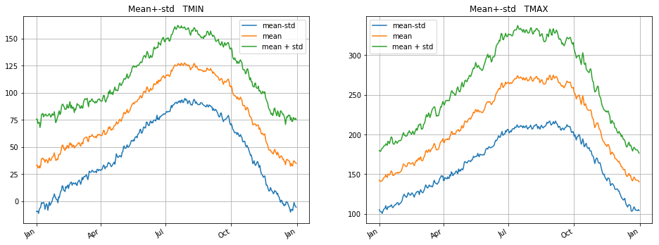</p>

The following figure is the distribution of TOBS and the PRCP.<p>
We found the variances in TOBS are similar in all months but the variances in PRCP is large in the winter but small in the summer.<p>
The distribution of TOBS is similar with TMIN and the TMAX. <p>
The largest PRCP is in the winter but the smallest PRCP is in the summer.<p>
<p>&nbsp;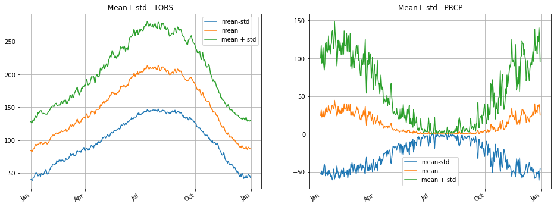</p>

The following figure is the distribution of SNOW and SNWD.<p>
We found the distributions of these two are similar.
Their average is 0 and the variance in the winter is large. 
<p>&nbsp;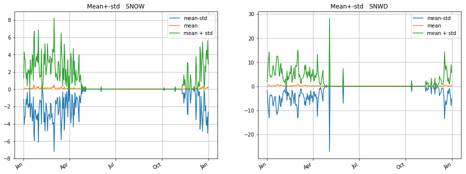</p>

### plotting top 3 eigenvectors
The following figures are the top three eigenvectors of TMIN and TMAX.<p>
The first eigenvector of TMIN is roughly constant in each month.<p>
The second eigenvector of TMIN is higher in the summer.<p>
The third eigenvector of TMIN is higher in the winter.<p>
The first eigenvector of TMAX is higher in the summer.<p>
The second eigenvector of TMAX is higher in the summer.<p>
The third eigenvector of TMAX is higher in the winter but lower in April.<p>
<p>&nbsp;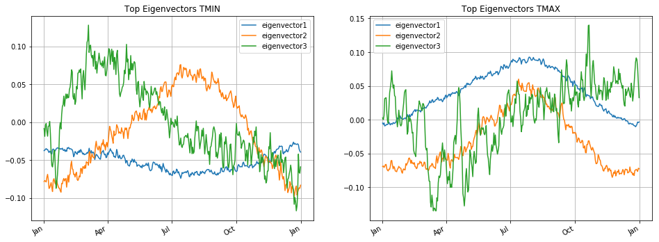</p>

The following figures are the top three eigenvectors of TOBS and PRCP.<p>
The first eigenvector of TOBS is roughly higher in the winter.<p>
The second eigenvector of TOBS is higher in the summer.<p>
The third eigenvector of TOBS is higher in the spring.<p>
The first eigenvector of PRCP is higher in the winter.<p>
The second eigenvector of PRCP is higher in the winter.<p>
The third eigenvector of PRCP is higher in the winter.<p>
<p>&nbsp;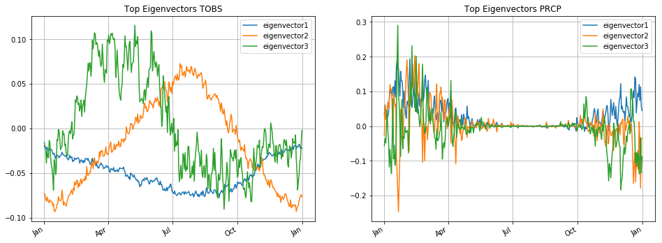</p>

The following figures are the top three eigenvectors of SNOW and SNWD.<p>
The these three eigenvectors of SNOW and SNWD are roughly higher in the winter.<p>
The these three eigenvectors of SNWD are nearly zero in the summer, fall and spring.<p>
<p>&nbsp;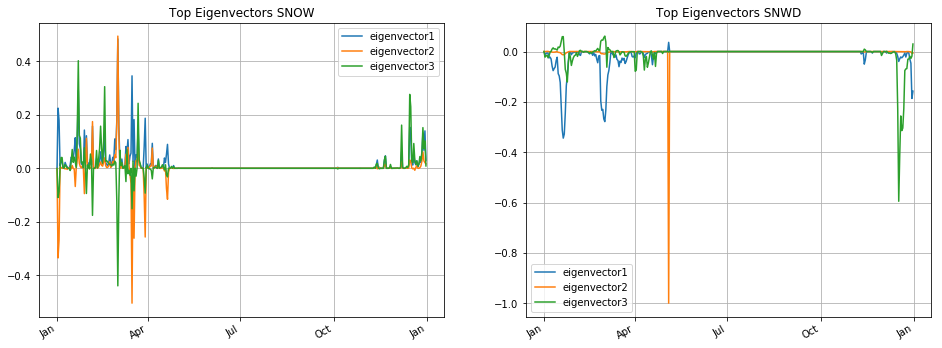</p>

### Script for plotting percentage of variance explained

The following figures are the percentage of variance explaned of TMIN, TOBS and TMAX.<p>
We found the percentage of variance explaned of these six are not so large and the increment
of the additional eigenvector is decreasing.<p>
When we use 5 eigenvectors, we can explain the 35% variance of TMIN.<p>
When we use 5 eigenvectors, we can explain the 60% variance of TOBS.<p>
When we use 5 eigenvectors, we can explain the 50% variance of TMAX.<p>
<p>&nbsp;</p>


The following figures are the percentage of variance explaned of SNOW, SNWD and PRCP.<p>
When we use 5 eigenvectors, we can explain the 30% variance of SNOW.<p>
When we use 5 eigenvectors, we can explain the 50% variance of SNWD.<p>
When we use 5 eigenvectors, we can explain the 16% variance of PRCP.<p>
<p>&nbsp;</p>


## 4.5 Weather Analysis - reconstruction PRCP

Fist, we will look at the PRCP of the last year.<p>
We found the most PRCP in the winter.<p>
<p>&nbsp;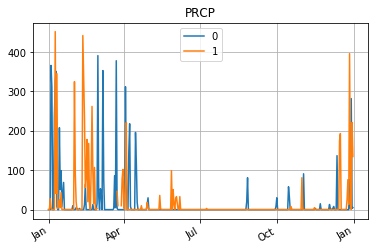</p>

### Plot Reconstructions for PRCP

Construct approximations of a time series using the mean and the 3 top eigen-vectors.<p>
First, we plot the mean of of PRCP every day and the top three eigenvectors.<p>
We found that these three eigenvectors are mostly in the winter.<p>
<p>&nbsp;</p>

### plot the percent of residual variance on average
After getting the eigenvectors, we want to know the variance explained.
We found when we use 8 eigenvectors, we can explain 25% variance.
<p>&nbsp;</p>

### Interactive plot of reconstruction

Following is the optimal reconstruction.<p>
The best coefficients are 520.7498195 , -584.3974631 and  242.33651692.<p>
And when we used these three eigenvectors, we can reconstruct the data to c2.<p>
We found that c2 is roughly close to the target but it is higher in February and it is lower in March, April, December and January.
<p>&nbsp;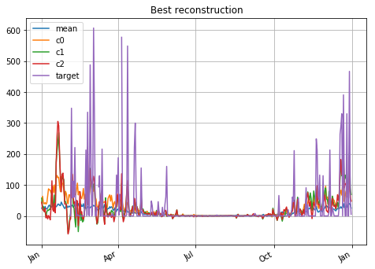</p>


### Process whole dataframe to find best and worse residuals
The following construction will get the best residuals.<p>
For some data, we can expain the 62% with these three best eigenvectors.<p>
<p>&nbsp;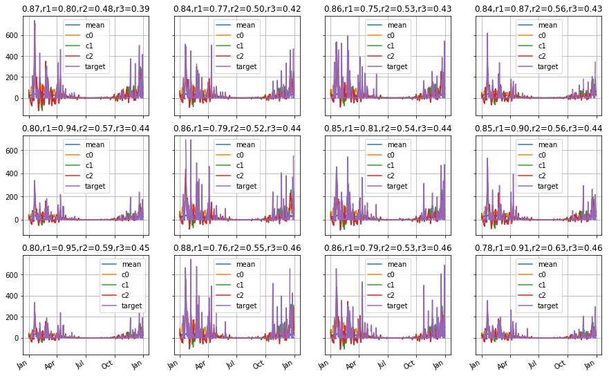</p>


The following construction will get the worst residuals.<p>
For some data, we even expain the 0% with these three worst eigenvectors.<p>
<p>&nbsp;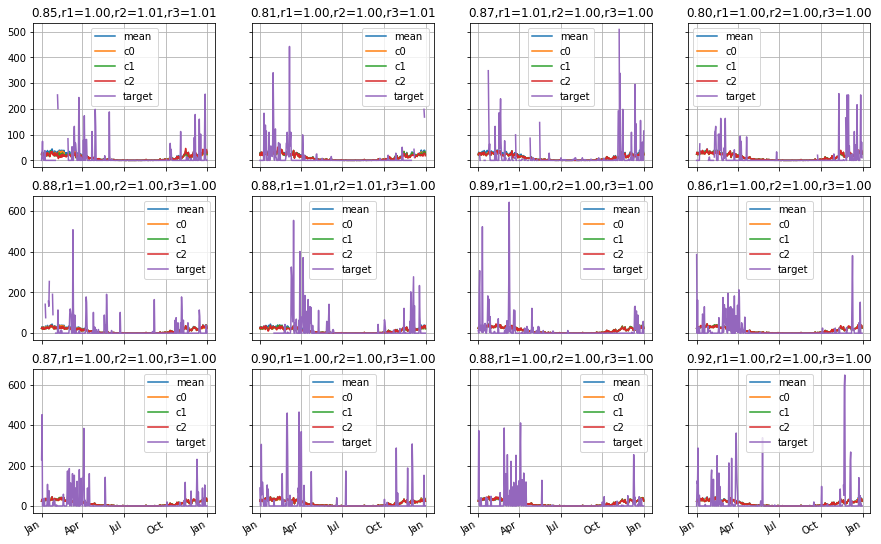</p>

### How well-explained are the vectors in this collection?

We found there are at least 88% resiudals in 20% data when we use these three eigenvectors.<p>
.<p>

<p>&nbsp;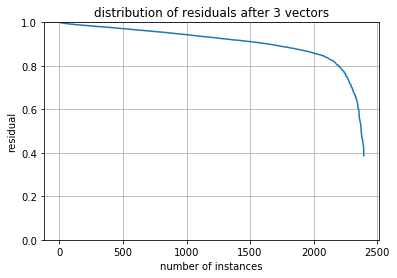</p>

### Plot Reconstructions for SNWD

Construct approximations of a time series using the mean and the three top eigen-vectors
First, we plot the mean and the top three eigenvectors.<p>
We found these eigenvectors are close to 0.<p>
<p>&nbsp;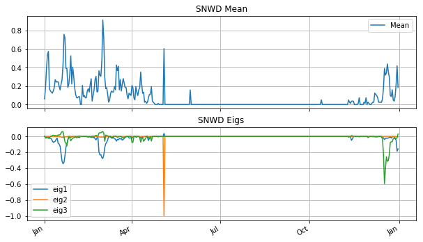</p>

### plot the percent of residual variance on average

Construct approximations of a time series using the mean and the three top eigen-vectors
We found that when we use only two eigenvectors, we can explain the 30% variance, the average is 15%.<p>
When we add extra two eigenvectors, it only explain extra 12% variance, which is less than 15%.<p>
In the end, when we use 9 eigenvectors, we can explain the nearly 70% variance.<p>

<p>&nbsp;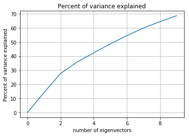</p>

### Process whole dataframe to find best and worse residuals
The following construction will get the best residuals.<p>
For some data, these two bext eigenvectors can explain nearly 99.99% to 18% variance.<p>
<p>&nbsp;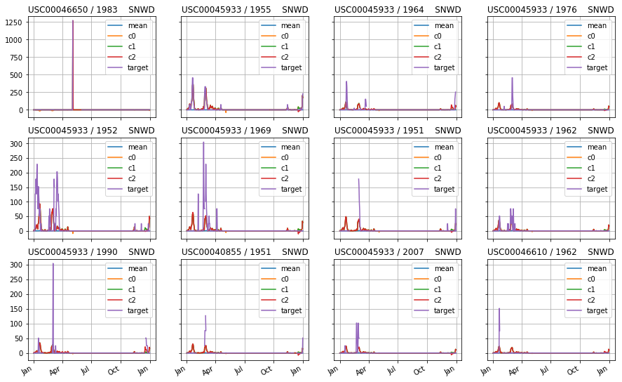</p>

The following construction will get the worst residuals.<p>
For some data, these two eigenvectors can explain nearly 11% - 14% variance.<p>
<p>&nbsp;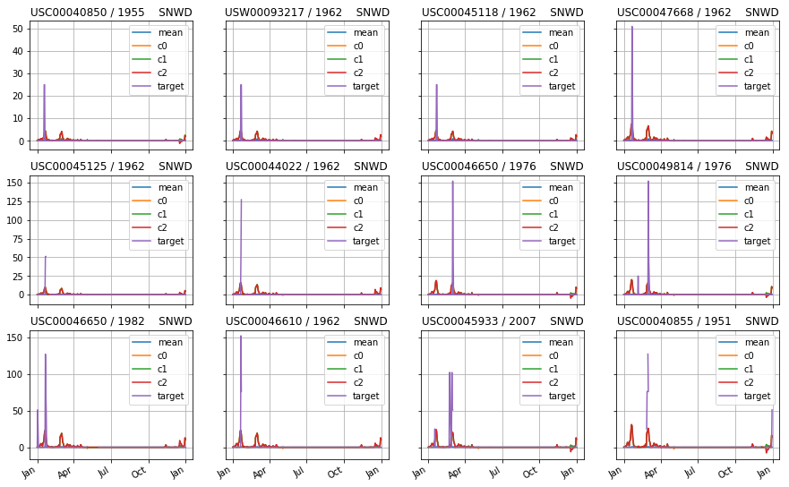</p>

### The best construction
We found the c2 is higher in March and cannot get the peak in February.<p>
<p>&nbsp;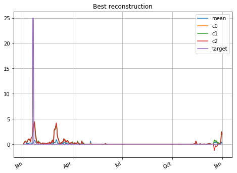</p>

### What is the distribution of the residuals and the coefficients?

We found for most 80% data, we can get only 95% residauls.<p>
For very small part of data, about 5%, we even get roughly 80% residuals.<p>

<p>&nbsp;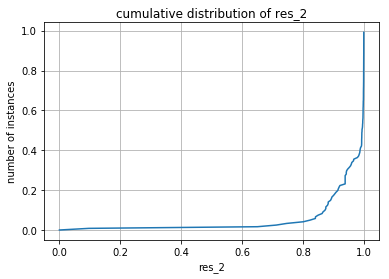</p>

We found for most data, our coefficients are near 0.<p>
<p>&nbsp;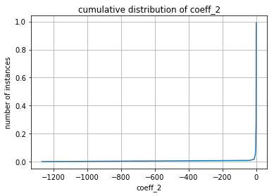</p>


### 5. maps using iPyLeaflet
Now, we will visualizing the distribution of the observations

#### Visualizing the distribution of the observations
<p>&nbsp;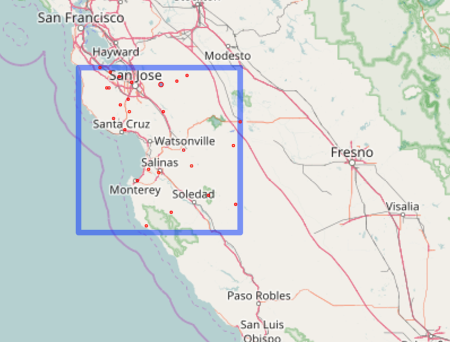</p>

#### the relationship between elevation and avg(coeff_1)
We found as the elevation is low, the absolute value of avg(coeff_1) is small

<p>&nbsp;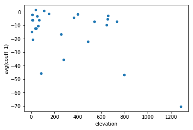</p>

### 5.5 DataOnMaps

#### the relationship between elevation and different coefficients
We found as the relationship between elevation and coefficient0 is not clear.
<p>&nbsp;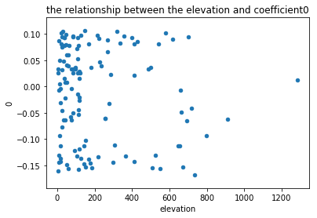</p>

We found as the relationship between elevation and coefficient1 is not clear.
<p>&nbsp;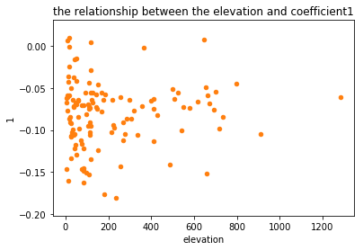</p>

We found as the relationship between elevation and coefficient2 is not clear.
<p>&nbsp;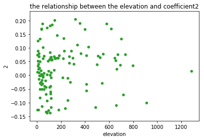</p>

We found as the most coefficient3 are concetrated in 0 to -0.1.
<p>&nbsp;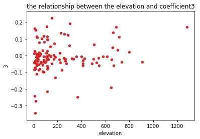</p>

### Analyze whether SNWD varies more from year to year or from place to place.
#### Estimating the effect of the year vs the effect of the station

To estimate the effect of time vs. location on the first eigenvector coefficient we
compute:<p>
We then compute the RMS before and after subtracting either the location effect 
or the time effect.<p>

From the table, we found that after considering location, the RMS decreases from 115 to 111.<p>
However, after considering the location effect, the RMS decreases from 115 to 81.<p>
In cincludsion, we can safely conclude that **the time effect is larger than the location effect**.
<table>
  <thead>
    <tr>
      <th>total RMS of location effect and time effect</th>
    </tr>
  </thead>
  <tbody>
    <tr>
      <td>total RMS</td>
      <td>115.389616809</td>
    </tr>
    <tr>
      <td>RMS removing mean-by-station</td>
      <td>111.496415332</td>
    </tr>
    <tr>
      <td>RMS removing mean-by-year</td>
      <td>81.6515975456</td>
    </tr>
  </tbody>
</table>

Now, we want to know whether we can make the residuals smaller and smaller.<p>
First, because the time effect is larger than the location effect, we deduct the time effect first and then location effect and time effect and so on.<p>
We can get the following table.<p>
From the talbe, we found the first time effect makes most impact.<p>
After first time effect, we add other location effects and time effects, the effect is very small.<p>
<table>
  <thead>
    <tr>
      <th>initial RMS= 115.389616809</th>
    </tr>
  </thead>
  <tbody>
    <tr>
      <td>0 after removing mean by year </td>
      <td>81.6515975456</td>
    </tr>
    <tr>
      <td>0 after removing mean by stations</td>
      <td>80.0354198345</td>
    </tr>
    <tr>
      <td>1 after removing mean by year </td>
      <td>79.3915039541</td>
    </tr>
    <tr>
      <td>1 after removing mean by stations</td>
      <td>79.1143187061</td>
    </tr>
    <tr>
      <td>2 after removing mean by year </td>
      <td>78.9885631575</td>
    </tr>
    <tr>
      <td>2 after removing mean by stations</td>
      <td>78.9293601758</td>
    </tr>
    <tr>
      <td>3 after removing mean by year </td>
      <td>78.9007020762</td>
    </tr>
    <tr>
      <td>3 after removing mean by stations</td>
      <td>78.886505866</td>
    </tr>
    <tr>
      <td>4 after removing mean by year </td>
      <td>78.8793237015</td>
    </tr>
    <tr>
      <td>4 after removing mean by stations</td>
      <td>78.8756137104</td>
    </tr>
  </tbody>
</table>

### Reconstruction using top eigen-vectors
Construct approximations of a time series using the mean and the 3 top eigen-vectors.<p>
First, we plot the mean of of PRCP every day and the top three eigenvectors.<p>
We found that these three eigenvectors are mostly in the winter.<p>
<p>&nbsp;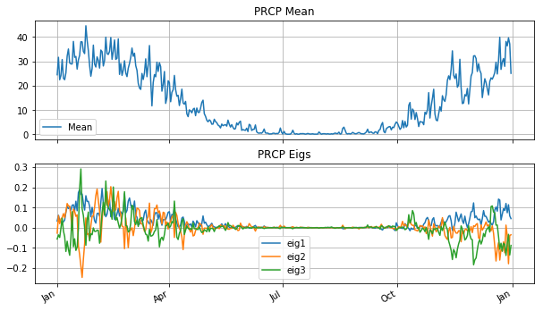</p>

After getting the eigenvectors, we want to know the variance explained.
We found when we use 8 eigenvectors, we can explain 25% variance.
<p>&nbsp;</p>


We found there are at least 88% resiudals in 20% data when we use these three eigenvectors.<p>
<p>&nbsp;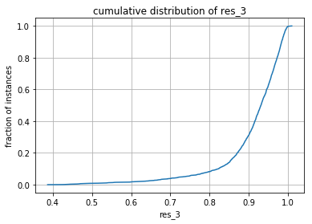</p>

From the figure, we can find that the rainfall is not uniform in eacg station and every day.<p>
It most concentrated in some location and some time slot.<p>
<p>&nbsp;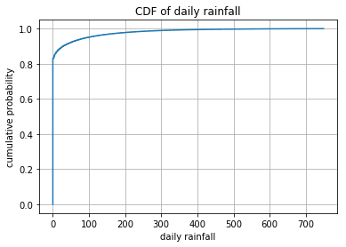</p>

We found the significant 0.4 is large because we let P_norm(i,i) = 0.4. <p>
As a result, when the significant is much less than 0.4, it means more indepedent.<p>
We found the the distribution of P_norm is close to normal distribution.<p>
And the mean is close to 0.15.
<p>&nbsp;</p>

Now, we want to know what kind of station is highly correlated.<p>
We used the following figure to see the correlationship.<p>
The stations at positions 0-22(left-up) are clearly strongly correlated with each other. Even though there are some stations, in positions 15-18 or so, which are more related to each other than to the rest of this block. 
<p>&nbsp;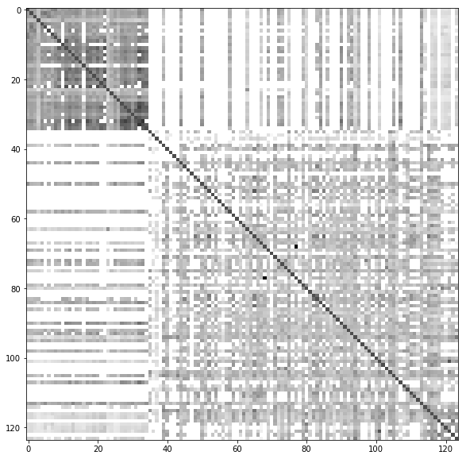</p>

Now, we use PCA to do decompose of it.<p>
When we found when we use 10 components, we can explain near 97% variance.<p>
Now we will use four components, which can explain near 80% variance.<p>
<p>&nbsp;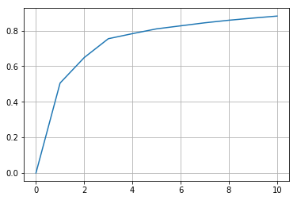</p>

We decompose the dimension to four dimenstions.<p>
And for total 124 stations, we order them with the components from PCA.<p>
We have four components, so we have four order of these stations.<p>
<p>&nbsp;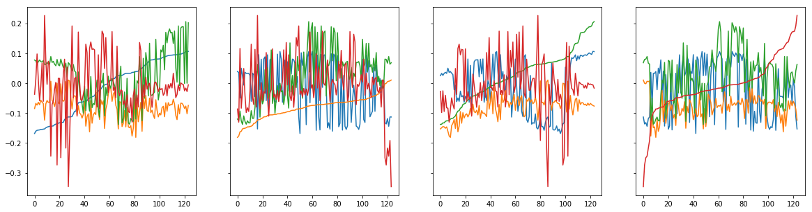</p>

When we got these 4 components, we order the station with these 4 components.<p>
After that, we do the normalized log probability for them to find the group with their dependency.<p>
We found at the top-left figure, the group is most clear.<p>
The first 50 stations are highly correlated and the last 30 stations are also correlated.<p>
As a result, we can group them into three groups: <p>
groupA: first 50 stations.<p>
groupB: last 30 stations.<p>
groupC: others.<p>
<p>&nbsp;</p>

### Concludsion
In these figures, we can group the stations with their PRCP.<p>
Also, we found these measurement are concentrated in some months and not uniform in each months.


```python

```
